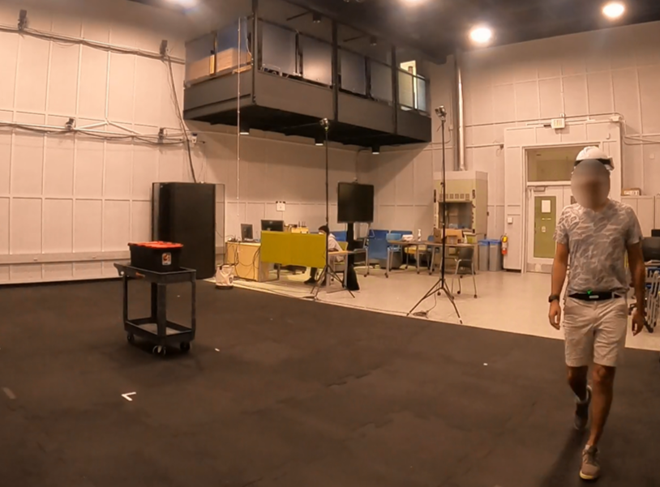

# Activity-Recognition

In this repository you can find the code for classification of the common activities of electrical line workers. We recruited 37 subjects to perform the 10 tasks listed below and collected the acceleration signals from a signle wrist-worn Empatica E4 accelerometer.

1. Sitting on a chair while keeping hands still on the chair arms for 3 minutes
2. Standing still for 3 minutes
3. Walking on a set path for 3 minutes
4. Hoisting a weighted bucket up and down to a height of 4 m for 10 repetitions
5. Lifting and lowering a weighted box for 20 repetitions
6. Pushing a cart on a set path for 10 repetitions
7. Typing on a computer for 3 minutes
8. Climbing up and down a ladder for 20 repetitions
9. Working on an electrical panel for 3 minutes
10. Inserting screws using a screw driver at an overhead height for 3 minute

The following picture shows a sample subject and the experiment area.



## Classification
We investigated the performance of ```k-Nearest Neighbors```, ```Support Vector Machines```, and ```Random Forest``` classifiers in combination with three feature sets (```time```, ```frequency```, and ```time-frequency```), and  two window lengths (4 and 10 seconds) for the classification. Also, we evaluated the classification performance in two scenarios of intra- and inter-subject. You can find the classification code in [Classification.ipynb](Classification.ipynb) notebook.

## Report
The classification models for each combination of classifiers, feature sets, and window lengths were trained and saved to a pickle file. For inter-subject this resulted in 90 files (for 5 hold out test sets) and for the intra-subject scenario since we trained the models on individual subjects the number of saved files summed up to 666. In [InterSubjectReport.ipynb](InterSubjectReport.ipynb) and [IntraSubjectReport.ipynb](IntraSubjectReport.ipynb) notebooks we load the trained models, evaluate the models on the test sets, perform the statistical analysis for the inter-subject case, and create the reports.

## LIME
Using the LIME algorithm [[1]](#1) we found the important features for 2 activities of electric panel and hoisting in frequency and time-frequency feature sets. We reconstructed the signals using the selected features to investigate the relevance of the selected features. We applied the method on 30 correctly classified windows for the electric panel and hoisting tasks and used the most frequently selected features for reconstruction. The codes for the frequency and time-frequency features are provided in [LIMEFFTReconstruction.ipynb](LIMEFFTReconstruction.ipynb) and [LIMEWaveletReconstruction.ipynb](LIMEWaveletReconstruction.ipynb) notebooks.

Also, all feature importance plots (for all activities) can be found at the bottom of the pages [here for the FFT features](https://saebragani.github.io/projects/HAR/LIMEFFTAllTasks.html) and [here for the wavelet features](https://saebragani.github.io/projects/HAR/LIMEWaveletAllTasks.html).

# References
<a id="1">[1]</a> Ribeiro, Marco Tulio, Sameer Singh, and Carlos Guestrin. "" Why should i trust you?" Explaining the predictions of any classifier." Proceedings of the 22nd ACM SIGKDD international conference on knowledge discovery and data mining. 2016.
